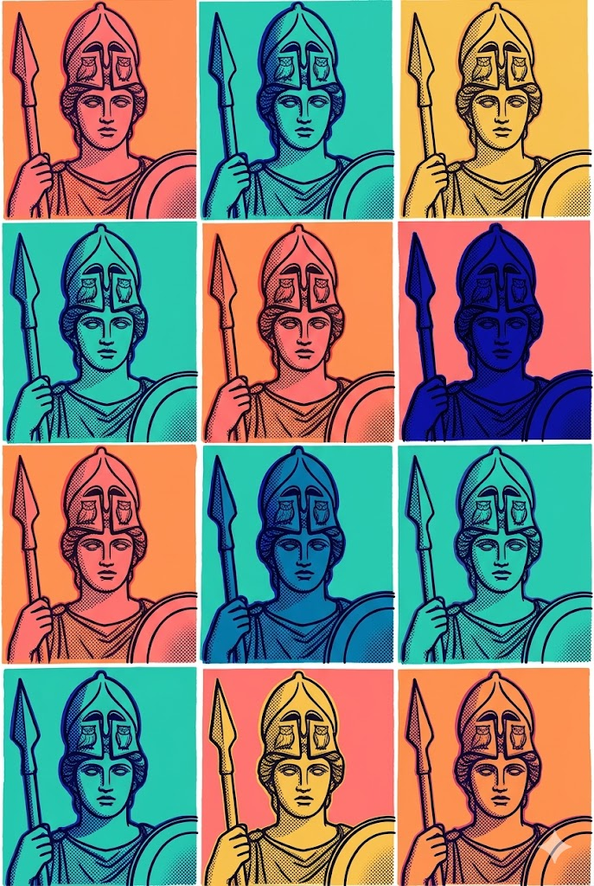



::: {.notes}
- Titilglæran er búin til úr YAML-hausnum með `hi-title` síunni
- Reitir: `title-theme`, `subtitle-highlight`, `presenters`, `event-meta`, `event-date`
- `subtitle-position: below` skiptir á röð titils og undirtitils
- `event-date: today` → leysir upp í réttum íslensku dagsetningu við útgáfu
:::

---

## Hvað er í þessum sniðmát

::: {.fa-card cols=3}
- palette | **HÍ hönnunarstaðall** | Jost leturgerð, litapaletta HÍ frá honnun.hi.is, vatnsmerki í bakgrunni
- layer-group | **Íhlutasafn** | kort, tilvitnun, skref, útlit, ábendingar, niðurteljari og fleira
- puzzle-piece | **Lua-viðbætur** | hi-title · card-enum · pause · menti
:::

::: {.notes}
- Allt sem þarf til að búa til vandaðar HÍ-merktar RevealJS-glærur
- Viðbæturnar fylgja með — engar sérstakar uppsetningar
- Virkar með `quarto use template tungufoss/quarto-hi`
:::

---

## fa-card — setningafræði

<span class="slide-subtitle">`::: {.fa-card cols=N}` · eitt listratriði per kort: `- tákn | **Titill** | meginmál`</span>

::: {.two-col}
::: {}
```markdown
::: {.fa-card cols=2}
- lightbulb | **Innsýn** | stuðningsupplýsingar
- users | **Markhópur** | hverjir verða fyrir áhrifum
:::
```

- Tákn: hvaða [Font Awesome](https://fontawesome.com/icons) heiti sem er
- `[brands] github` forskeytið fyrir vörumerkjatákn
- `**feitir**`, `_skáletrir_`, `` `kóði` `` virka hvar sem er
- `cols=` setur fjölda korta á röð — umfar fer á næstu röð
- Bættu við `/undirtitill` sem 3. hluta fyrir lítinn texta yfir meginmál
:::

::: {}
::: {.fa-card cols=2}
- lightbulb | **Innsýn** | /Skref 1 | stuðningsupplýsingar
- users | **Markhópur** | hverjir verða fyrir áhrifum
:::
:::
:::

::: {.notes}
- card-enum.lua vinnur girðta div í HTML-hnitanet
- Þrjár breiddir í boði: cols=1, cols=2, cols=3
:::

---

## fa-card — litir

**Sjálfgefið** — allt blátt

::: {.fa-card cols=3}
- star | **Eitt** | meginmál
- heart | **Tvö** | meginmál
- bolt | **Þrjú** | meginmál
:::

**Sérsniðin litur** — forskeytið `[hi-red]`, `[hi-teal]`, `[hi-pink]` o.s.frv.

::: {.fa-card cols=3}
- star | **Eitt** | meginmál
- [hi-red] heart | **Tvö** | stendur upp úr í rauðu
- bolt | **Þrjú** | meginmál
:::

::: {.notes}
- Sjálfgefið: öll kort eru blá — samræmt og skýrt
- Forskeyttu hvaða tákn sem er með [hi-red] / [hi-teal] / [hi-pink] / [hi-yellow] / [hi-orange] / [hi-green]
:::

---

## fa-card — útvíkkuð setningafræði

<span class="slide-subtitle">Undirlistar `* atriði`, formúla `~ texti`, innfellt tákn `[tákn-nafn]`</span>

::: {.fa-card cols=2}
- chart-bar | **Með undirlistum** | stuðningslýsing | * Fyrsta atriði | * Annað atriði | * Þriðja atriði
- function | **Með formúlu** | tvær inntakslegar | ~ [arrow-up] Inntak [plus] Samhengi [arrow-right] Úttak
:::

::: {.lean-in}
`- tákn | titill | meginmál | * atriði | * atriði` · `- tákn | titill | meginmál | ~ [tákn] texti`
:::

::: {.notes}
- Pípuskiptar: tákn | titill | meginmál | viðbætur
- * forskeytið → upptalningarlisti innan kortsins
- ~ forskeytið → formúlulína; [tákn-nafn] sýnir FA-tákn
:::

---

## Skref

<span class="slide-subtitle">`::: {.steps}` · eitt listratriði per skref: `- Merki | lýsing`</span>

::: {.steps}
- Skilgreina | umfang vandans
- Hanna | inngripið
- Framkvæma | og fylgjast með
- Meta | niðurstöður
:::

::: {.lean-in}
Litir skiptast sjálfkrafa í gegnum HÍ-litapalettuna.
:::

::: {.notes}
- .steps skapar örvalaga skrefatákn
- Allt að 6 skref — litaskipti: blátt → teal → gult → appelsínugult → rautt → grænt
:::

---

## Tilvitnun, ábending og fullyrðing

> Gæði endurgjafar skipta meira máli en tíðni hennar.

::: {.callout}
Að hanna mat **fyrir** faglega hæfni, ekki bara prófa hana.
:::

::: {.statement}
Iðnaðurinn gefur ekki einkunn á kúrfu — við ættum heldur ekki.
:::

::: {.notes}
- blockquote → blár vinstri jaðar, stór texti
- .callout → gult bakgrunnur, feitletraður áhersla
- .statement → skýr vinstri strik fyrir meginstaðhæfingar
:::

---

## Útlit og reitir

<span class="slide-subtitle">`.two-col` · `.three-col` · `.img-split` · `.block` afbrigði</span>

::: {.two-col}
::: {}
**Vinstri dálkur** — texti, listar eða hvaða efni sem er.

- Fyrsta atriði með smá útskýringu
- Annað atriði með meiri útskýringu

::: {.block}
**Skilgreining** — hlutlægt, blár jaðar.
:::

::: {.example-block}
**Dæmi** — teal-blær, jákvæð framing.
:::
:::

::: {}
**Hægri dálkur** — sömu sveigjanleikinn.

::: {.block .alert}
**Viðvörun** — gult, varúð eða fyrirvari.
:::

::: {.block .danger}
**Hætta** — rautt, villa eða mikilvæg aðvörun.
:::

::: {.lean-in}
Raðaðu reitum með `.block-grid` fyrir samræmt bil.
:::
:::
:::

::: {.notes}
- .two-col: jafnt 1fr 1fr hnitanet
- .three-col: þrír jafnir dálkar
- .img-split á glæruhaus: texti til vinstri, fullhæð mynd til hægri
:::

---

## Myndaskipting {.img-split}

::: {.slide-content}
<span class="kicker">Útlit</span>
<h2 class="r-fit-text">img-split</h2>

Bættu `.img-split` við glæruhaus til að fá fullhæð myndarsvæði til hægri.

::: {.block}
Texti og íhlutir fara í `.slide-content`. Myndin fyllir hægri svæðið kant-í-kant.
:::
:::

<figure>

</figure>

::: {.notes}
- .img-split glærur hafa ekkert spássíur — myndin blæðir að jöðrum
- Stýrðu hlutfallinu með CSS-breytum --img-split-text-width / --img-split-image-width
:::

---

## Gervigreindargengin mynd {.img-split}

::: {.slide-content}
<span class="kicker">Hvatverk</span>
<h2>Gervigreindargengin mynd</h2>

Notaðu `.img-split` með `<figure>` og `<figcaption class="caption-prompt">` til að sýna gervigreindargenginni mynd með hvatkverki sýnilegt. Bættu við `data-ai="Gemini"` (eða Midjourney, DALL·E…) til að nafngefna tólið.

::: {.block}
`<figcaption class="caption-prompt" data-ai="Gemini">` → **GEMINI PROMPT ·**
Sleppa `data-ai` → **PROMPT ·**
:::
:::

<figure>

<figcaption class="caption-prompt" data-ai="Gemini">Pop Art (Warhol): Djarf Warhol-stíll fyrir merki Háskóla Íslands — Pallas Aþenu — hvert svæði lifjótt litprentstef. Litatafla: #10099F #2DD2C0 #FAC55B #FC8484 #FFA05F á hvítu. Þykkar útlínur, flöt rástpunktar, enginn texti, lóðrætt snið.</figcaption>
</figure>

::: {.notes}
- data-ai="Gemini" → "GEMINI PROMPT · " með CSS attr()
- data-ai="Midjourney" → "MIDJOURNEY PROMPT · " — hvaða strengur sem er virkar
- Sleppa data-ai → venjulegt "PROMPT · "
:::

---

## Pása — niðurteljari í tíma

<span class="slide-subtitle">Styttikóði: `pause` og fjöldi sekúndna</span>

::: {.two-col}
::: {}
Settu inn tímaðar hlé með niðurteljaranum.

Setningafræði: tvær slaufur, `< pause 300 >`, tvær lokunarslaufur — þar sem `300` er fjöldi sekúndna.

- Alltaf í sekúndum (`300` = 5 mín, `600` = 10 mín)
- Klukkan telur niður í vafranum
- Bakgrunnur glærunnar verður gult þegar tíminn er upp
- Tungumálsmeðvitað: **Break** (EN) / **Pása** (IS)
:::

::: {}
::: {.block}
`pause`-viðbótin er í `_extensions/pause/`. Bættu `pause.lua` í síulistann þinn.
:::
::: {.lean-in}
Næsta glæra er lifandi 30 sekúndna pásadæmi — smelltu á örina til að sjá hana.
:::
:::
:::

::: {.notes}
- Frábært fyrir vinnustofur, fyrirlestra og æfingar í tíma
- Niðurteljari keyrir á biðlaranum í gegnum body-after.inc JavaScript
:::

---



---

## Menti — svar frá áhorfendum

<span class="slide-subtitle">Settu skilríki í YAML · notaðu `.menti-login` fyrir innskráningarglæruna · `data-menti="true"` fyrir spurningaglærur</span>

::: {.two-col}
::: {}
**YAML-haus:**

```yaml
menti_url: "https://www.menti.com/..."
menti_display_url: "www.menti.com"
menti_code: "1234 5678"
menti_qr: "img/menti-qr.png"
```

**Innskráningarglæra:**
```markdown
## {.focus-slide .menti-login intro="Skannaðu QR-kóðann"}
```

**Spurningaglæra** (sýnir lifandi Menti):
```markdown
## {data-menti="true"}
```
:::

::: {}
::: {.block}
`menti`-viðbótin les skilríki einu sinni úr YAML og setur þau sjálfkrafa inn í hverja innskráningar- og spurningaglæru.
:::
::: {.example-block}
Næstu tvær glærur sýna lifandi innskráningarglæru og spurningaglæru — með staðgengilsskilríki.
:::
:::
:::

::: {.notes}
- menti.lua er í _extensions/menti/
- Bættu _extensions/menti/menti.lua í síulistann
- QR-kóðamynd þarf að vera gefin sérstaklega — flytja út úr Menti
:::

---

## {.focus-slide .menti-login intro="Skannaðu QR-kóðann til að taka þátt"}

---

## {data-menti="true"}

<aside class="notes">Menti-spurningaglæra — lifandi Menti-gluggi hleðst hér í rauntímakynningu.</aside>

---

## Spurningar? {.focus-slide}

::: {.two-col}
::: {}
{.contact-photo}
:::

::: {}


::: {.lean-in}
Skiptu út `hi-vr-ii.jpg` fyrir eigin mynd. Tengiliðaspjaldið er búið til úr `presenters` í YAML.
:::
:::
:::

::: {.notes}
- Tengiliðaglæra: mynd til vinstri, tengiliðakort til hægri
- .contact-photo klippir til að passa í dálkinn
:::
